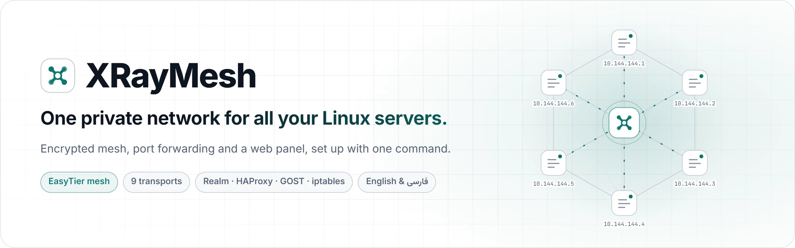
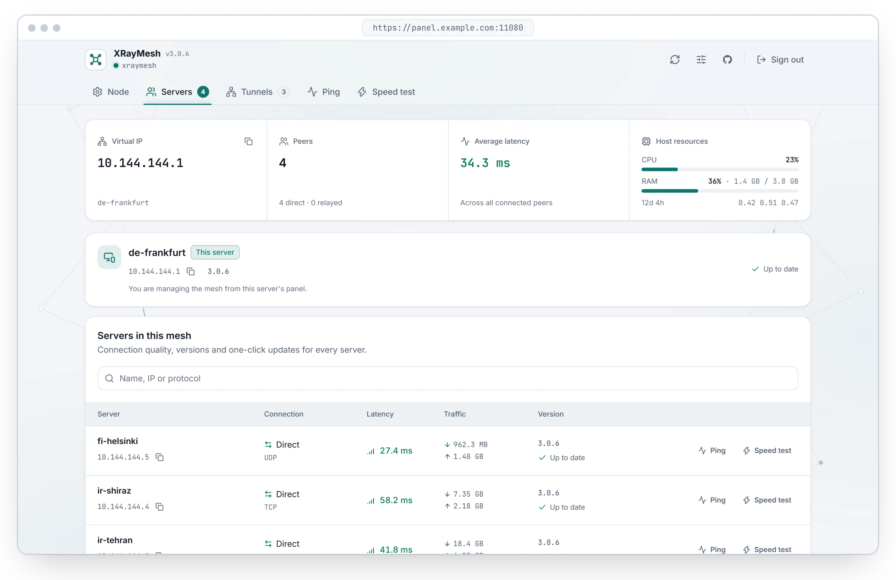
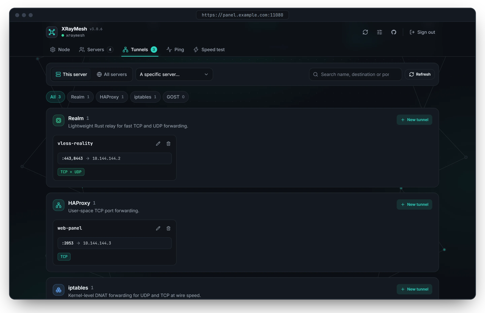
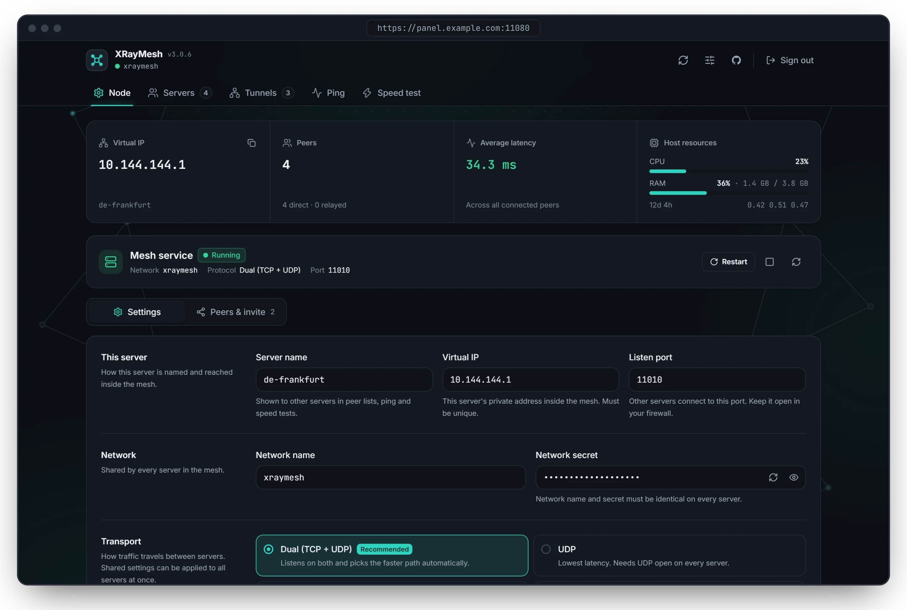
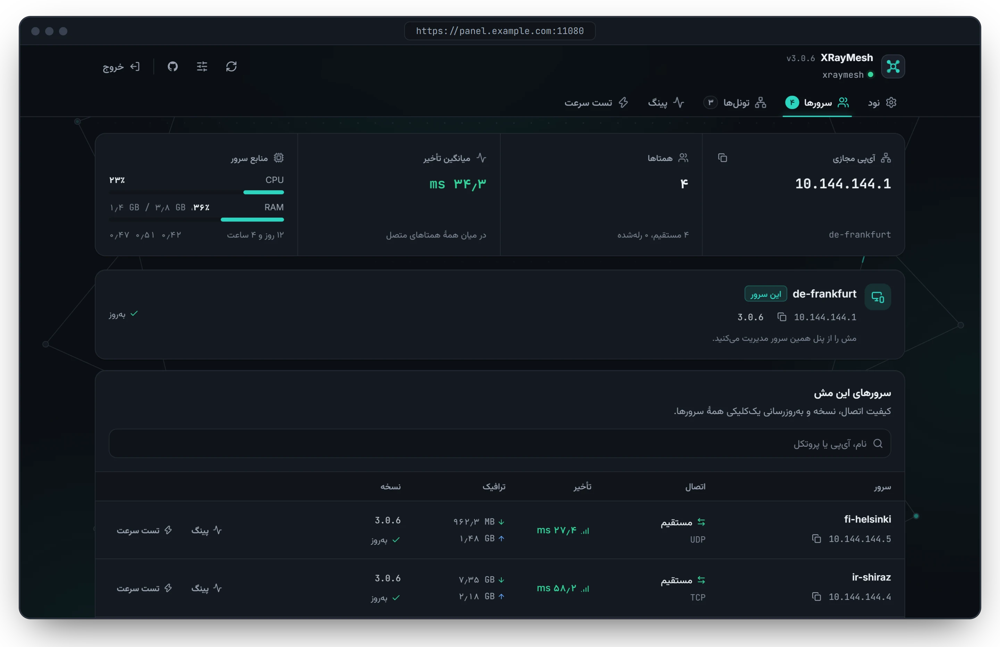

<p align="center">
  <picture>
    <source media="(prefers-color-scheme: dark)" srcset="assets/readme/banner-en-dark.webp" />
    
  </picture>
</p>

<p align="center">
  <a href="https://github.com/mdjes/SuTun/releases/tag/v3.1.0"></a>
  <a href="LICENSE"></a>
  
  
  
</p>

<p align="center">
  <a href="https://mdjes.github.io/SuTun/"><strong>📖 Documentation</strong></a>
  &nbsp;&nbsp;•&nbsp;&nbsp;
  <a href="#-quick-install"><strong>🚀 Install</strong></a>
  &nbsp;&nbsp;•&nbsp;&nbsp;
  <a href="#-features"><strong>✨ Features</strong></a>
  &nbsp;&nbsp;•&nbsp;&nbsp;
  <a href="#-support-the-project"><strong>💚 Support</strong></a>
  &nbsp;&nbsp;•&nbsp;&nbsp;
  <a href="README_FA.md"><strong>🇮🇷 فارسی</strong></a>
</p>

<br />

SuTun joins your Linux servers into **one encrypted private network** with [EasyTier](https://github.com/EasyTier/EasyTier), forwards ports between them, and gives you **a web panel to run it all**, in English or Persian. Install it with one command, create a mesh on the first server, and add the others with an invite code.

<p align="center">
  <picture>
    <source media="(prefers-color-scheme: dark)" srcset="assets/readme/panel-servers-dark.webp" />
    
  </picture>
</p>

## ✨ Features

<table>
  <tr>
    <td width="33%" valign="top">
      <h3>🌐 Private mesh</h3>
      Every server gets a private address like <code>10.144.144.2</code> and reaches the others directly, encrypted.
    </td>
    <td width="33%" valign="top">
      <h3>🛰️ Nine transports</h3>
      TCP, UDP, WebSocket, QUIC, FakeTCP, and ICMP or PCK links by <a href="https://github.com/AminMGMT/BackPack">BackPack</a> for networks where little gets through.
    </td>
    <td width="33%" valign="top">
      <h3>🖥️ Web panel</h3>
      Live peers, latency and traffic, ping and speed tests between any two servers. Light and dark, English and Persian.
    </td>
  </tr>
  <tr>
    <td width="33%" valign="top">
      <h3>🔀 Port forwarding</h3>
      Realm, HAProxy, GOST or kernel iptables, from a single port to whole ranges and port maps.
    </td>
    <td width="33%" valign="top">
      <h3>⚡ SafeSync</h3>
      Change shared settings on every server at once. A server that loses its peers rolls back on its own.
    </td>
    <td width="33%" valign="top">
      <h3>🔐 Secure by default</h3>
      One-time login links, optional password-free sign-in, rate limiting and free HTTPS with Let's Encrypt.
    </td>
  </tr>
</table>

## 🚀 Quick install

Run this on each **Debian or Ubuntu** server, as `root`:

```bash
bash <(curl -fsSL https://raw.githubusercontent.com/mdjes/SuTun/main/sutun.sh)
```

1. **Open the login link** the installer prints. It works once, within 60 minutes.
2. **Create a mesh** on the first server and copy its invite code.
3. **Join the other servers** with that code. They show up under **Servers** within seconds.

Need details? Follow the [getting started guide](https://mdjes.github.io/SuTun/start/introduction/). New login link any time: `sudo sutun token`.

## 📚 Documentation

The full documentation, in English and Persian, lives at **[mdjes.github.io/SuTun](https://mdjes.github.io/SuTun/)**.

| | Guide | What's inside |
| :---: | :--- | :--- |
| 🧭 | [Getting started](https://mdjes.github.io/SuTun/start/introduction/) | Requirements, installation, first sign-in, creating a mesh, adding servers |
| 🔀 | [Port forwarding](https://mdjes.github.io/SuTun/guides/tunnels/) | The four tunnel engines and port formats |
| 🛰️ | [Mesh transports](https://mdjes.github.io/SuTun/guides/transports/) | Which of the nine transports to pick, including ICMP and PCK |
| 🛠️ | [Troubleshooting](https://mdjes.github.io/SuTun/troubleshooting/) | Fixes for the most common problems |
| ⌨️ | [Terminal commands](https://mdjes.github.io/SuTun/reference/cli/) | Every `sutun` command |

<details>
<summary><strong>🖼️ More screenshots</strong></summary>
<br />

**Port-forwarding tunnels across the mesh**



**Node settings**



**The panel in Persian**



</details>

<details>
<summary><strong>📦 Looking for the terminal-only v1.x?</strong></summary>
<br />

The legacy CLI-only release stays available at [v1.7.0](https://github.com/mdjes/SuTun/tree/v1.7.0):

```bash
bash <(curl -fsSL https://raw.githubusercontent.com/mdjes/SuTun/v1.7.0/sutun.sh)
```

</details>

## 💚 Support the project

SuTun is free for personal use and built by one developer. If it keeps your servers connected, a donation helps keep it going. A ⭐ on GitHub helps too.

> [!WARNING]
> Send each coin **only on the network shown**. Coins sent on another network are lost.

**USDT** on **TRC20 (Tron)**

```text
TKM87mEXhUpEBzqvNxs1qjM4EddX6VMXmw
```

**Gram (TON)** on **TON**

```text
UQDfjT-h4ENIrt_Sq5-zBy9TvhckniwSLCkS7zIVX4fVSaFw
```

**Bitcoin (BTC)**

```text
bc1qc4cgy5etuwj2375c5zqma7xmjtk59s5s49rfp5
```

QR codes for every address are on the [support page](https://mdjes.github.io/SuTun/support/).

---

## License & Intellectual Property

Copyright (c) 2026 mdjes. All Rights Reserved.

This project is protected under the **[SuTun Source-Available License](LICENSE)**.

- **Permitted:** Free for personal, non-commercial, and internal server usage.
- **Strictly Prohibited:** You may **not** copy, redistribute, mirror, fork, or republish this project or any derivative work under another author, developer, brand, or repository name without prior written permission from mdjes.
- Commercial monetization and white-label rebranding are strictly prohibited.
- Third-party components (such as EasyTier and [BackPack](https://github.com/AminMGMT/BackPack), AGPL-3.0) remain subject to their respective licenses.

Created and maintained with passion by [mdjes](https://github.com/mdjes).
