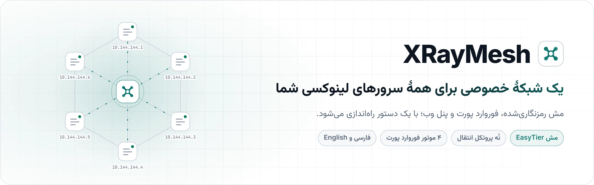
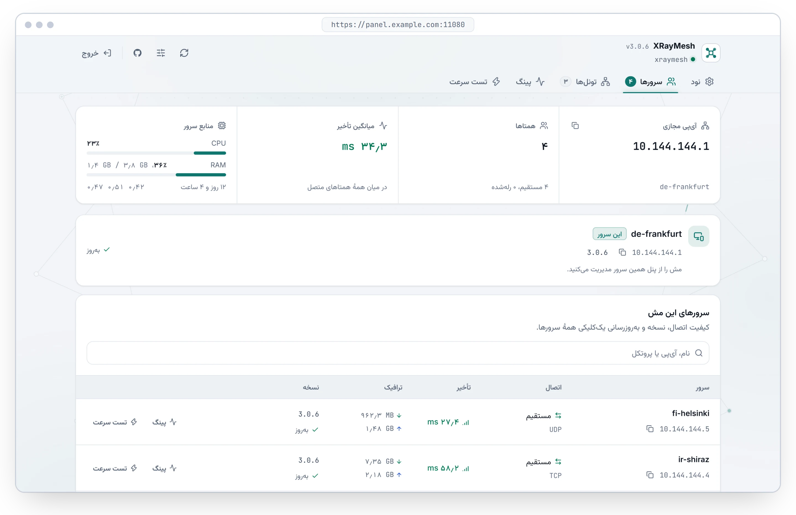

<p align="center">
  <picture>
    <source media="(prefers-color-scheme: dark)" srcset="assets/readme/1790729801434.webp" />
    
  </picture>
</p>

<p align="center">
  <a href="https://github.com/mdjes/SuTun/releases/tag/v3.1.0"></a>
  <a href="LICENSE"></a>
  
  
</p>

<p align="center">
  <a href="https://mdjes.github.io/SuTun/fa/"><strong>📖 مستندات</strong></a>
  &nbsp;&nbsp;•&nbsp;&nbsp;
  <a href="#-نصب-سریع"><strong>🚀 نصب</strong></a>
  &nbsp;&nbsp;•&nbsp;&nbsp;
  <a href="#-قابلیتها"><strong>✨ قابلیت‌ها</strong></a>
  &nbsp;&nbsp;•&nbsp;&nbsp;
  <a href="#-حمایت-از-پروژه"><strong>💚 حمایت</strong></a>
  &nbsp;&nbsp;•&nbsp;&nbsp;
  <a href="README.md"><strong>🇬🇧 English</strong></a>
</p>

<br />

با SuTun سرورهای لینوکسی شما با کمک [EasyTier](https://github.com/EasyTier/EasyTier) در **یک شبکهٔ خصوصی رمزنگاری‌شده** به هم وصل می‌شوند، بین آن‌ها پورت فوروارد می‌شود و برای مدیریت همهٔ این‌ها **یک پنل وب فارسی و انگلیسی** دارید. با یک دستور نصبش کنید، روی سرور اول یک مش بسازید و بقیهٔ سرورها را با کد دعوت اضافه کنید.

<p align="center">
  <picture>
    <source media="(prefers-color-scheme: dark)" srcset="assets/readme/panel-servers-fa-dark.webp" />
    
  </picture>
</p>

## ✨ قابلیت‌ها

<table dir="rtl">
  <tr>
    <td width="33%" valign="top">
      <h3>🌐 مش خصوصی</h3>
      هر سرور یک نشانی خصوصی مثل <code>10.144.144.2</code> می‌گیرد و مستقیم و رمزنگاری‌شده به سرورهای دیگر دسترسی دارد.
    </td>
    <td width="33%" valign="top">
      <h3>🛰️ نُه پروتکل انتقال</h3>
      TCP، UDP، WebSocket، QUIC، FakeTCP، و لینک‌های ICMP و PCK با <a href="https://github.com/AminMGMT/BackPack">BackPack</a> برای شبکه‌هایی که تقریباً هیچ چیز از آن‌ها رد نمی‌شود.
    </td>
    <td width="33%" valign="top">
      <h3>🖥️ پنل وب</h3>
      همتاها، تأخیر و ترافیک زنده، پینگ و تست سرعت بین هر دو سرور. تیره و روشن، فارسی و انگلیسی.
    </td>
  </tr>
  <tr>
    <td width="33%" valign="top">
      <h3>🔀 فوروارد پورت</h3>
      با Realm، HAProxy، GOST یا iptables هسته؛ از یک پورت تا یک بازهٔ کامل و نگاشت پورت.
    </td>
    <td width="33%" valign="top">
      <h3>⚡ SafeSync</h3>
      تغییر تنظیمات مشترک روی همهٔ سرورها به‌طور هم‌زمان. سروری که ارتباطش قطع شود، خودش به تنظیمات قبلی برمی‌گردد.
    </td>
    <td width="33%" valign="top">
      <h3>🔐 امن از همان ابتدا</h3>
      لینک ورود یک‌بارمصرف، ورود بدون رمز، محدودیت تلاش برای ورود و HTTPS رایگان با Let's Encrypt.
    </td>
  </tr>
</table>

## 🚀 نصب سریع

این دستور را روی هر سرور **Debian یا Ubuntu** و با کاربر `root` اجرا کنید:

```bash
bash <(curl -fsSL https://raw.githubusercontent.com/mdjes/SuTun/main/sutun.sh)
```

<ol dir="rtl">
  <li><strong>لینک ورودی را که نصب‌کننده نمایش می‌دهد باز کنید.</strong> فقط یک بار و تا ۶۰ دقیقه کار می‌کند.</li>
  <li><strong>روی سرور اول یک مش بسازید</strong> و کد دعوتش را کپی کنید.</li>
  <li><strong>سرورهای دیگر را با همان کد وصل کنید.</strong> چند ثانیه بعد در بخش <strong>سرورها</strong> دیده می‌شوند.</li>
</ol>

جزئیات بیشتر را در [راهنمای شروع کار](https://mdjes.github.io/SuTun/fa/start/introduction/) ببینید. هر وقت لینک ورود تازه خواستید: `sudo sutun token`

## 📚 مستندات

مستندات کامل، به فارسی و انگلیسی، در **[mdjes.github.io/SuTun/fa](https://mdjes.github.io/SuTun/fa/)** است.

<table dir="rtl">
  <tr><th></th><th>راهنما</th><th>محتوا</th></tr>
  <tr><td align="center">🧭</td><td><a href="https://mdjes.github.io/SuTun/fa/start/introduction/">شروع کار</a></td><td>پیش‌نیازها، نصب، اولین ورود، ساخت مش و افزودن سرورها</td></tr>
  <tr><td align="center">🔀</td><td><a href="https://mdjes.github.io/SuTun/fa/guides/tunnels/">فوروارد پورت</a></td><td>چهار موتور تونل و قالب پورت‌ها</td></tr>
  <tr><td align="center">🛰️</td><td><a href="https://mdjes.github.io/SuTun/fa/guides/transports/">پروتکل‌های انتقال</a></td><td>انتخاب از میان نُه پروتکل، از جمله ICMP و PCK</td></tr>
  <tr><td align="center">🛠️</td><td><a href="https://mdjes.github.io/SuTun/fa/troubleshooting/">رفع مشکل</a></td><td>راه‌حل رایج‌ترین مشکل‌ها</td></tr>
  <tr><td align="center">⌨️</td><td><a href="https://mdjes.github.io/SuTun/fa/reference/cli/">دستورهای ترمینال</a></td><td>همهٔ دستورهای <code>sutun</code></td></tr>
</table>

<details dir="rtl">
<summary><strong>🖼️ تصاویر بیشتر</strong></summary>
<br />

**تونل‌های فوروارد پورت در سراسر مش**


**تنظیمات نود**


</details>

<details dir="rtl">
<summary><strong>📦 دنبال نسخهٔ قدیمی و صرفاً ترمینالی هستید؟</strong></summary>
<br />

نسخهٔ قدیمی صرفاً ترمینالی همچنان در [v1.7.0](https://github.com/mdjes/SuTun/tree/v1.7.0) در دسترس است:

```bash
bash <(curl -fsSL https://raw.githubusercontent.com/mdjes/SuTun/v1.7.0/sutun.sh)
```

</details>

## 💚 حمایت از پروژه

پروژهٔ SuTun برای استفادهٔ شخصی رایگان است و یک نفر آن را می‌سازد. اگر سرورهایتان را به هم وصل نگه می‌دارد، کمک مالی شما به ادامهٔ آن کمک می‌کند. دادن ⭐ در GitHub هم کمک می‌کند.

> ⚠️ **هشدار:** هر ارز را **فقط روی شبکه‌ای که کنارش نوشته شده** بفرستید. ارزی که روی شبکهٔ دیگری فرستاده شود از دست می‌رود.

ارز **USDT** روی شبکهٔ **TRC20 (Tron)**

```text
TKM87mEXhUpEBzqvNxs1qjM4EddX6VMXmw
```

ارز **Gram (TON)** روی شبکهٔ **TON**

```text
UQDfjT-h4ENIrt_Sq5-zBy9TvhckniwSLCkS7zIVX4fVSaFw
```

**بیت‌کوین (BTC)**

```text
bc1qc4cgy5etuwj2375c5zqma7xmjtk59s5s49rfp5
```

کدهای QR همهٔ آدرس‌ها در [صفحهٔ حمایت](https://mdjes.github.io/SuTun/fa/support/) هستند.

---

## مجوز و حق مالکیت معنوی (License)

تمامی حقوق مادی و معنوی این اثر متعلق به **mdjes** می‌باشد.

این پروژه تحت مجوز انحصاری **[SuTun Source-Available License](LICENSE)** محافظت می‌شود:
- **استفاده مجاز:** دانلود و استفاده شخصی، غیرتجاری و داخلی روی سرورها برای تمامی کاربران کاملاً رایگان و آزاد است.
- **ممنوعیت‌های صریح قانونی:** هیچ شخص، گروه یا شرکتی بدون کسب اجازه کتبی از توسعه‌دهنده اصلی (mdjes) حق **کپی‌برداری، بازنشر، ایجاد میرور، فورک و انتشار با نام خود یا برند دیگر، حذف کپی‌رایت و فروش تجاری** این سورس‌کد و اسکریپت را ندارد.
- هسته EasyTier، [BackPack](https://github.com/AminMGMT/BackPack) (با مجوز AGPL-3.0) و سایر ابزارهای شخص ثالث تابع قوانین و لایسنس اختصاصی خود باقی می‌مانند.

طراحی و توسعه‌یافته با ❤️ توسط [mdjes](https://github.com/mdjes).
